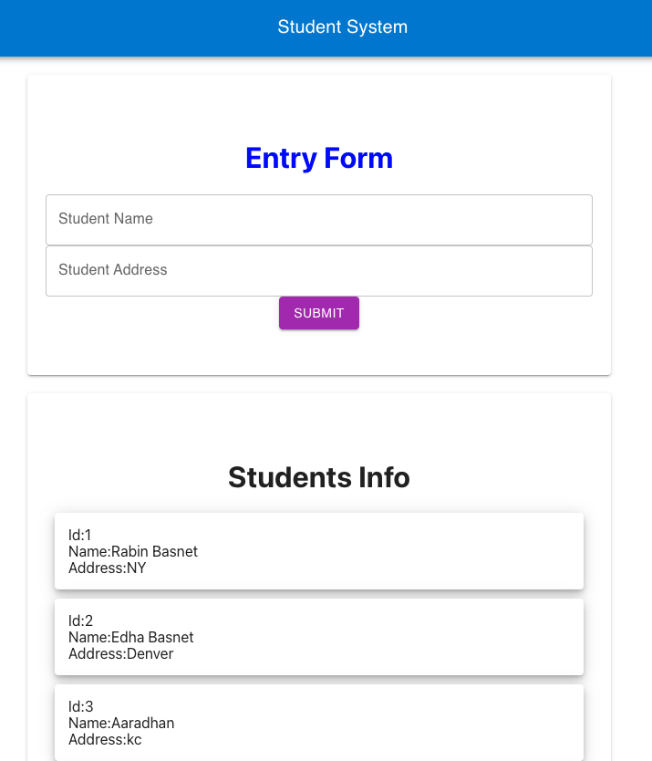

# StudentApplication
## Technologies
* HTML/CSS
* JavaScript
* Java
* React.js
* Hooks
* Spring Boot
* Spring Data
* MySql
* Maven
* Rest API
* Material UI
* JPA

# Features
* Add names & address
* view list

# Main page

## License
Licensed under the [MIT License](LICENSE).
